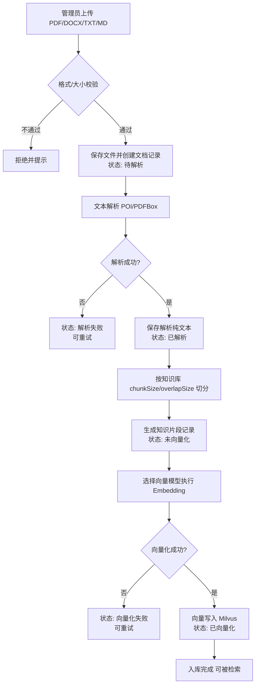
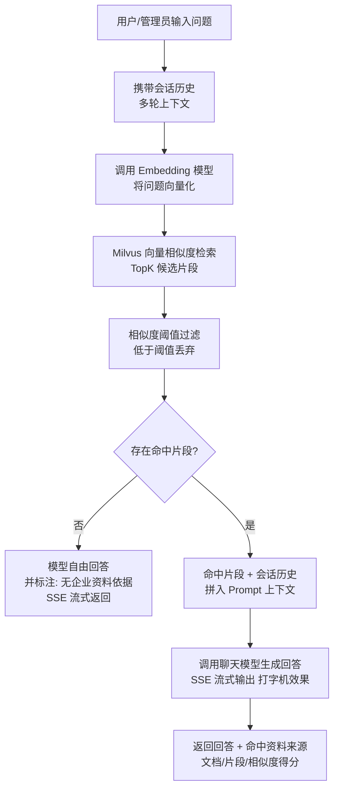

# PRD：企业 AI 知识库智能问答系统（管理端）

| 项目信息 | 内容 |
| --- | --- |
| 文档版本 | v1.1 |
| 撰写角色 | 产品经理 |
| 语言 | 简体中文 |
| 项目代号 | enterprise_ai_kb |

> 修订记录：v1.1：Milvus 替换 PGVector、多轮记忆、流式输出、检索参数可配置等 11 项决策落稿（2026-09-02）。

> 说明：本项目为客户指定技术栈，以下技术选型均按客户要求原样执行，不做变更。

## 1. 项目概述

### 1.1 背景

企业内部及外部访客中存在大量"不了解企业信息"的人群（新员工、合作伙伴、客户），他们需要快速获取企业介绍、制度、产品资料等信息。传统人工客服响应慢、成本高，且知识分散在各类文档中难以检索。本项目构建一套基于 RAG（检索增强生成）的企业 AI 知识库智能问答系统：管理员将企业文档上传入库，系统自动解析、切分、向量化；用户提问时，系统先检索最相似的知识片段，再交由大模型生成有依据的回答，并附带资料来源，避免凭空编造。

本期先交付**管理端**（`/admin` 路径登录管理员账号），完成知识库建设与 RAG 问答效果验证的完整闭环；用户端默认路径本期仅显示"页面开发中"占位页，后续版本开放。

### 1.2 产品目标

1. **知识资产结构化管理**：管理员可将 PDF/DOCX/TXT/MD 企业文档统一入库，按知识库分类组织，并可配置切片策略（chunkSize / overlapSize）。
2. **完整 RAG 工程链路**：覆盖"文档上传 → 文本解析 → 片段切分 → Embedding 向量化 → Milvus 入库 → 相似度检索 → Prompt 上下文拼接 → 模型生成（流式输出）→ 资料来源追踪"全流程。
3. **答案可信可追溯**：每条回答同时返回命中的知识片段来源（所属文档、相似度得分），让回答有依据、可验证。

### 1.3 名词解释

| 名词 | 解释 |
| --- | --- |
| RAG | Retrieval-Augmented Generation，检索增强生成：先检索知识片段，再将其拼入 Prompt 交由大模型生成回答 |
| Embedding | 将文本映射为高维向量的模型，用于计算语义相似度 |
| Milvus | 开源向量数据库，提供向量相似度检索能力，本项目以 standalone 模式部署 |
| chunkSize | 知识片段切分长度（字符数） |
| overlapSize | 相邻片段之间的重叠长度，用于保留上下文连贯性 |
| TopK | 相似度检索返回的前 K 条片段 |
| 相似度阈值 | 过滤低于该相似度得分的片段，保证上下文质量 |
| 知识片段（Segment） | 文档解析文本按 chunkSize/overlapSize 切分后的最小检索单元 |
| 会话上下文 | 多轮问答中携带的历史对话记录，用于模型理解追问指代 |
| 历史条数 | 会话中保留的最大历史消息轮数，由管理员配置 |
| SSE | Server-Sent Events，服务端向浏览器流式推送回答内容的技术，实现打字机效果 |
| OpenAI 兼容接口 | 与 OpenAI API 格式兼容的模型服务接口（如 LMStudio、Ollama、vLLM 等本地/自托管服务） |

## 2. 用户角色与权限

| 角色 | 说明 | 本期 | 后续 |
| --- | --- | --- | --- |
| 管理员（admin） | 系统运营者，负责用户管理、模型配置、知识库/文档/片段管理、问答验证 | ✅ 完整支持 | 持续演进 |
| 普通用户（user） | 企业信息的咨询方，通过用户端首页与 AI 客服弹窗提问 | ❌ 仅占位（"页面开发中"） | 登录/注册/个人信息/修改密码、系统首页、AI 客服弹窗 |

权限边界（本期）：

- 管理员登录入口：`/admin`，未登录访问管理端任意页面重定向至登录页。
- 根路径 `/` 进入用户端，本期渲染占位页，不提供任何业务功能。
- 用户注册/登录相关后端接口本期可预留，不强制实现。

## 3. 用户故事

### 管理员（本期）

- **US-01 登录与账号安全**：作为管理员，我想通过账号密码登录管理端，并支持查看/修改个人信息与密码，以便安全地管理知识库系统。
  - 验收要点：登录成功后进入工作台；错误凭证有明确提示；修改密码后旧密码失效；登录态失效后访问管理页面被重定向到登录页。
- **US-02 用户信息管理**：作为管理员，我想查看管理系统所有用户的信息，并支持新增用户、删除用户、重置密码，以便掌握用户规模并做基础运维。
  - 验收要点：用户列表支持分页与关键字搜索；支持新增用户（账号、昵称、初始密码）；支持删除用户（二次确认，不可删除自己）；支持重置密码（重置为初始密码或生成新密码并展示）；操作有二次确认。
- **US-03 AI 模型配置**：作为管理员，我想分别维护聊天模型与向量（Embedding）模型的配置（API 地址、Key、模型名），以便灵活替换模型并对比效果。
  - 验收要点：两类模型配置相互独立；均通过 OpenAI 兼容接口接入（兼容 LMStudio、Ollama、Llama、vLLM 等本地/自托管服务），Key 可为空；配置保存后即可在向量化与问答中使用；密钥在界面上脱敏显示。
- **US-04 知识库管理**：作为管理员，我想创建/编辑知识库分类，并配置该库的 chunkSize 与 overlapSize，以便不同类型资料采用不同切片策略。
  - 验收要点：新建知识库必填名称，chunkSize/overlapSize 有默认值与合法性校验（chunkSize > overlapSize ≥ 0）；修改切片参数后提示对存量文档重新切分并重新向量化（见 F-16）；删除知识库时级联删除其下文档、片段与 Milvus 向量。
- **US-05 知识文档上传与解析**：作为管理员，我想上传 PDF/DOCX/TXT/MD 文档，系统自动解析为纯文本并展示解析状态与解析文本，以便确认文档内容被正确提取。
  - 验收要点：仅接受四类格式，其他格式上传报错；单文件 ≤ 100MB；单知识库文档个数不限；不限制并发上传；解析状态可见（如：解析中/成功/失败）；解析成功后可查看全文纯文本。
- **US-06 片段切分与管理**：作为管理员，我想让系统按知识库配置的 chunkSize/overlapSize 将文档文本切分为片段，并可查看、维护片段，以便控制检索粒度。
  - 验收要点：切分参数取自所属知识库配置；片段列表展示片段序号与内容；支持查看片段向量化状态（单条编辑/删除为 P2）。
- **US-07 片段向量化**：作为管理员，我想选择某个向量模型对片段执行 Embedding 并写入 Milvus，以便知识可被语义检索。
  - 验收要点：可按文档/知识库维度批量触发向量化；向量化过程有状态（未开始/进行中/完成/失败）；失败可重试；完成后向量写入 Milvus。
- **US-08 智能客服问答验证**：作为管理员，我想在管理端输入问题验证 RAG 问答效果，支持多轮会话上下文与流式输出，并查看命中的资料来源，以便上线前验证答案质量。
  - 验收要点：回答由聊天模型基于命中片段生成，支持多轮会话（携带历史上下文，可理解"它/上述"等指代）；回答以 SSE 流式输出（打字机效果）；同步展示命中片段列表（来源文档、片段内容、相似度得分）；TopK 与相似度阈值由管理员配置并生效（低于阈值的片段不进入 Prompt）；无命中片段时模型自由回答并标注"无企业资料依据"。

### 普通用户（后续版本）

- **US-09 注册与登录**：作为访客，我想注册并登录用户端，以便获得持续的个性化服务。
- **US-10 系统首页**：作为访客，我想在首页看到产品能力介绍，以便快速了解该系统能回答哪些问题。
- **US-11 AI 客服问答**：作为用户，我想通过客服弹窗提问并得到基于企业资料的准确回答，以便自助解决问题。
  - 验收要点：问答链路与管理端验证一致（多轮上下文 → 检索 → 拼接 → 流式生成 → 返回来源）；提供历史会话展示（单会话设计，不做多会话列表）与回答来源展示；历史条数上限由管理员配置；无命中知识时模型自由回答并标注"无企业资料依据"。

## 4. 功能需求池

优先级定义：P0 = Must have（本期必须交付）；P1 = Should have（本期尽量交付）；P2 = Nice to have（后续迭代）。

| 编号 | 功能名称 | 描述 | 优先级 | 所属端 |
| --- | --- | --- | --- | --- |
| F-01 | 管理员登录 | 账号密码登录，登录态管理，登出 | P0 | 管理端 |
| F-02 | 个人信息 | 查看并修改管理员昵称/头像等基础信息 | P1 | 管理端 |
| F-03 | 修改密码 | 校验旧密码后设置新密码 | P0 | 管理端 |
| F-04 | 用户信息管理 | 用户列表分页、搜索、查看详情、新增用户、删除用户、重置密码、启用/禁用 | P0 | 管理端 |
| F-05 | 聊天模型配置 | 维护聊天模型配置（API 地址、Key 可空、模型名），通过 OpenAI 兼容接口接入 LMStudio/Ollama/Llama/vLLM 等本地或自托管服务，支持多个配置 | P0 | 管理端 |
| F-06 | 向量模型配置 | 维护 Embedding 模型配置（OpenAI 兼容接口，Key 可空），与聊天模型独立 | P0 | 管理端 |
| F-07 | 知识库管理 | 知识库分类的增删改查，配置 chunkSize/overlapSize | P0 | 管理端 |
| F-08 | 知识文档上传 | 支持 PDF/DOCX/TXT/MD 上传，格式校验，单文件 ≤ 100MB，文档数不限，不限并发上传 | P0 | 管理端 |
| F-09 | 文档文本解析 | 调用 Apache POI / PDFBox 将文档解析为纯文本，记录解析状态 | P0 | 管理端 |
| F-10 | 片段切分 | 按知识库 chunkSize/overlapSize 切分为知识片段 | P0 | 管理端 |
| F-11 | 片段管理 | 片段列表查看、详情、状态展示 | P0 | 管理端 |
| F-12 | 片段向量化 | 选择向量模型执行 Embedding，写入 Milvus，支持批量与重试 | P0 | 管理端 |
| F-13 | 问答验证 | 管理端智能客服问答：多轮会话上下文（会话/消息落库）+ RAG 检索 + SSE 流式输出 + 无命中时模型自由回答并标注"无企业资料依据" + 展示命中来源 | P0 | 管理端 |
| F-14 | 工作台 | 管理端首页：知识库/文档/片段/用户统计概览 | P1 | 管理端 |
| F-15 | 片段编辑/删除 | 单条片段内容编辑与删除（同步 Milvus 向量） | P2 | 管理端 |
| F-16 | 文档重新解析/重新切分 | 知识库切片参数变更后，对存量文档重新切分并重新向量化（含 Milvus 旧向量清理） | P0 | 管理端 |
| F-17 | 用户端占位页 | 根路径显示"页面开发中" | P0 | 用户端 |
| F-18 | 用户注册/登录 | 用户端账号体系 | P2 | 用户端 |
| F-19 | 系统首页 | 产品能力介绍页 | P2 | 用户端 |
| F-20 | AI 客服弹窗 | 用户端问答弹窗（与管理端共用 RAG 链路，多轮记忆 + 流式输出） | P2 | 用户端 |
| F-21 | 问答历史记录 | 保存问答会话记录便于回溯：单会话设计（不做多会话列表），回答附带来源展示；会话最高历史条数由管理员配置 | P2 | 通用 |
| F-22 | 问答导出 | 问答记录导出 Excel | P2 | 管理端 |
| F-23 | 系统配置 | 检索参数与体验参数管理员可配置：TopK、相似度阈值（可在知识库或全局层面覆盖）、会话最高历史条数（服务后续用户端单会话） | P0 | 管理端 |

**统计：P0 共 15 项，P1 共 2 项，P2 共 6 项，合计 23 项。**

## 5. 核心业务流程

### 5.1 文档入库全流程（RAG Pipeline）



### 5.2 用户问答 RAG 流程



## 6. 页面结构与管理端页面清单

### 6.1 前端路由策略

| 路径 | 页面 | 说明 |
| --- | --- | --- |
| `/` | 用户端首页 | 本期显示"页面开发中"占位页 |
| `/admin` | 管理端登录页 | 管理员账号登录入口 |
| `/admin/*` | 管理端业务页面 | 登录态守卫，未登录重定向 `/admin` |

### 6.2 管理端页面清单

| 页面 | 核心元素 |
| --- | --- |
| 登录页 `/admin` | 账号、密码输入框，登录按钮，系统名称/Logo |
| 工作台 | 统计卡片（知识库数、文档数、片段数、已向量化片段数、用户数），快捷入口 |
| 个人信息页 | 基础信息表单，修改密码表单（旧密码/新密码/确认新密码） |
| 用户管理 | 用户列表表格（分页）、搜索框、新增用户弹窗、删除操作（二次确认）、重置密码操作、启用/禁用操作 |
| 模型配置 | 聊天模型配置列表+表单（名称、API 地址、Key 可空、模型名），向量模型配置列表+表单；说明：通过 OpenAI 兼容接口接入，兼容 LMStudio、Ollama、Llama、vLLM 等本地/自托管服务 |
| 知识库列表 | 知识库表格（名称、chunkSize、overlapSize、文档数、片段数），新建/编辑弹窗，删除（级联删除其下文档、片段与 Milvus 向量，二次确认提示影响范围），切片参数变更后提示重新切分并重新向量化 |
| 知识库详情 | 库信息、该库下文档列表入口、切片参数展示 |
| 文档管理 | 文档列表（名称、类型、大小、解析状态、片段数），上传按钮（格式校验、单文件 ≤ 100MB、不限数量与并发），解析文本查看抽屉 |
| 片段管理 | 片段列表（所属文档、序号、内容摘要、向量化状态），详情弹窗，批量向量化按钮 |
| 系统配置 | 检索参数（TopK、相似度阈值）与会话最高历史条数的配置表单（管理员可修改，保存后生效） |
| 问答验证页 | 对话式问答窗口（多轮会话上下文、SSE 流式打字机效果），命中来源面板（文档名、片段内容、相似度得分），模型选择（聊天/向量模型下拉） |

### 6.3 关键页面线框（文字版）

**登录页**

```
+--------------------------------------+
|        企业 AI 知识库智能问答系统        |
|  +--------------------------------+  |
|  |  账号: [________________]      |  |
|  |  密码: [________________]      |  |
|  |        [ 登 录 ]               |  |
|  +--------------------------------+  |
+--------------------------------------+
```

**管理端整体布局（登录后）**

```
+-----------------------------------------------------------+
| Logo  企业AI知识库            管理员 ▾   修改密码  退出登录   |
+----------+------------------------------------------------+
| 工作台     |  [面包屑: 当前页面]                              |
| 用户管理   |                                                |
| 模型配置   |           页面主体内容区                          |
| 系统配置   |                                                |
| 知识库管理 |                                                |
| 文档管理   |                                                |
| 片段管理   |                                                |
| 问答验证   |                                                |
+----------+------------------------------------------------+
```

**问答验证页**

```
+--------------------------------+---------------------+
|  对话区（多轮会话）                |  命中来源面板         |
|  [问题气泡]                      |  ─ 片段1            |
|  [回答气泡-流式打字机效果]        |    来源: 文档A.pmd    |
|                                 |    相似度: 0.87      |
|  ┌───────────────────┐ [发送]    |  ─ 片段2            |
|  │ 输入问题...         │          |    来源: 文档B.docx  |
|  └───────────────────┘          |    相似度: 0.81      |
+--------------------------------+---------------------+
```

## 7. 数据实体草案

### 7.1 sys_user（用户表，MySQL）

| 字段 | 类型建议 | 说明 |
| --- | --- | --- |
| id | BIGINT PK | 主键 |
| username | VARCHAR(64) | 登录账号，唯一 |
| password | VARCHAR(128) | 密码（加密存储） |
| nickname | VARCHAR(64) | 昵称 |
| avatar | VARCHAR(255) | 头像 URL |
| role | TINYINT/VARCHAR | 角色：admin / user |
| status | TINYINT | 0 禁用 / 1 启用 |
| create_time / update_time | DATETIME | 创建/更新时间 |

### 7.2 model_config（模型配置表，MySQL）

| 字段 | 类型建议 | 说明 |
| --- | --- | --- |
| id | BIGINT PK | 主键 |
| model_type | TINYINT | 1 聊天模型 / 2 向量模型 |
| model_name | VARCHAR(128) | 模型名称（调用 OpenAI 兼容接口时的 model 参数，如 qwen2.5:7b、nomic-embed-text） |
| api_url | VARCHAR(255) | OpenAI 兼容接口地址（LMStudio / Ollama / Llama / vLLM 等本地或自托管服务） |
| api_key | VARCHAR(255) | 密钥（加密存储，本地服务可为空） |
| status | TINYINT | 是否启用/默认 |
| create_time / update_time | DATETIME | 时间戳 |

### 7.3 knowledge_base（知识库表，MySQL）

| 字段 | 类型建议 | 说明 |
| --- | --- | --- |
| id | BIGINT PK | 主键 |
| name | VARCHAR(128) | 知识库分类名称 |
| description | VARCHAR(512) | 描述 |
| chunk_size | INT | 切片长度（字符数） |
| overlap_size | INT | 重叠长度（字符数） |
| create_time / update_time | DATETIME | 时间戳 |

### 7.4 knowledge_document（知识文档表，MySQL）

| 字段 | 类型建议 | 说明 |
| --- | --- | --- |
| id | BIGINT PK | 主键 |
| kb_id | BIGINT | 所属知识库 ID（FK） |
| file_name | VARCHAR(255) | 原始文件名 |
| file_type | VARCHAR(16) | pdf / docx / txt / md |
| file_size | BIGINT | 文件大小（字节） |
| file_path | VARCHAR(512) | 存储路径 |
| parse_status | TINYINT | 0 待解析 / 1 解析中 / 2 成功 / 3 失败 |
| parse_content | LONGTEXT | 解析后的纯文本 |
| segment_count | INT | 切分片段数 |
| create_time / update_time | DATETIME | 时间戳 |

### 7.5 knowledge_segment（知识片段表，MySQL）

| 字段 | 类型建议 | 说明 |
| --- | --- | --- |
| id | BIGINT PK | 主键 |
| doc_id | BIGINT | 所属文档 ID（FK） |
| kb_id | BIGINT | 所属知识库 ID（冗余，便于批量） |
| segment_index | INT | 片段序号（从 0/1 起） |
| content | TEXT | 片段文本 |
| vector_status | TINYINT | 0 未向量化 / 1 进行中 / 2 完成 / 3 失败 |
| model_config_id | BIGINT | 使用的向量模型配置 ID |
| create_time / update_time | DATETIME | 时间戳 |

### 7.6 Milvus 向量 Collection（替代独立向量表）

不再使用关系型数据库存储向量，向量数据统一写入 Milvus（standalone 部署）。Collection 设计建议：

| 字段 | 类型建议 | 说明 |
| --- | --- | --- |
| segment_id | INT64（主键） | 对应 MySQL 片段 ID |
| doc_id | INT64 | 冗余文档 ID，便于按文档过滤/删除 |
| kb_id | INT64 | 冗余知识库 ID，便于按知识库过滤/级联删除 |
| embedding | FLOAT_VECTOR(n) | 片段向量，维度 n 由所选 Embedding 模型决定 |

> 注：向量维度 n 取决于所选 Embedding 模型，需在模型配置中明确（见待确认问题 Q1）。删除知识库/文档、切片参数变更重切分时，需按 kb_id/doc_id 同步删除 Milvus 中对应向量。

### 7.7 chat_session（会话表，MySQL，草案）

服务多轮上下文记忆与后续用户端历史会话展示。单会话设计（不做多会话列表）。

| 字段 | 类型建议 | 说明 |
| --- | --- | --- |
| id | BIGINT PK | 主键 |
| owner_type | TINYINT | 1 管理员（问答验证）/ 2 普通用户（后续版本） |
| owner_id | BIGINT | 会话归属者 ID |
| title | VARCHAR(128) | 会话标题（可取首条问题摘要） |
| create_time / update_time | DATETIME | 时间戳 |

### 7.8 chat_message（消息表，MySQL，草案）

| 字段 | 类型建议 | 说明 |
| --- | --- | --- |
| id | BIGINT PK | 主键 |
| session_id | BIGINT | 所属会话 ID（FK） |
| role | TINYINT | 1 用户提问 / 2 模型回答 |
| content | LONGTEXT | 消息内容（回答为完整文本，流式结束后落库） |
| hit_segments | JSON | 命中片段信息（segment_id、doc_id、相似度得分），用于来源展示 |
| no_evidence | TINYINT | 是否"无企业资料依据"的回答（无命中兜底） |
| create_time | DATETIME | 时间戳 |

> 注：多轮问答时按"会话最高历史条数"（管理员可配，见 F-23）截取最近 N 条历史消息拼入 Prompt。

## 8. 非功能性需求

### 8.1 环境与版本（客户指定，原样执行）

| 项 | 版本要求 |
| --- | --- |
| JDK | 21 |
| 后端框架 | SpringBoot 3 + Spring AI + MyBatis + PageHelper + Hutool + Apache POI + PDFBox |
| 前端 | Vue3 + Vite + Element-Plus + Vue-Router + Axios |
| MySQL | 5.7 或 8（业务数据与会话/消息数据） |
| Milvus | 2.x standalone（向量数据；Windows 通过 Docker Desktop 部署） |
| Node.js | ≥ 18 |
| Maven | ≥ 3.8 |
| Navicat | ≥ 16（数据库管理工具） |
| 操作系统 | 需附 Windows 本地 Docker Desktop 部署 Milvus 教程（交付物） |

### 8.2 性能

- 列表页接口响应 ≤ 1s（分页 + 常规数据量）；文档上传 ≤ 100MB 文件在 60s 内完成解析。
- 问答接口采用 SSE 流式输出（打字机效果），首 token 返回目标 ≤ 3s，端到端时间受模型 API 网络影响。
- 批量向量化需支持任务化处理，避免阻塞主线程；失败可重试、可查看进度。

### 8.3 安全

- 密码与 API Key 不得明文存储；API Key 界面脱敏显示。
- 管理端接口需登录态鉴权（Token/Session），角色校验 admin。
- 上传文件做格式白名单校验（仅 pdf/docx/txt/md）与大小限制，防范恶意文件。

### 8.4 兼容性

- 前端兼容 Chrome / Edge 最新两个大版本。
- MySQL 5.7 与 8 均需可运行；Milvus 2.x standalone（Windows 通过 Docker Desktop 部署）。
- 聊天模型与向量模型通过 OpenAI 兼容接口接入，需兼容 LMStudio、Ollama、Llama、vLLM 等本地/自托管服务，不锁定任何云服务商。

## 9. 待确认问题清单

| 编号 | 问题 | 影响 |
| --- | --- | --- |
| Q1 | 具体默认模型选型（LMStudio / Ollama / vLLM 等本地服务中选哪个作为交付默认）与向量维度 n 是多少？ | 影响模型配置默认值、Milvus Collection 向量维度与部署教程 |
| Q2 | 会话最高历史条数的默认取值（TopK 与相似度阈值的默认值建议 K=5、阈值 0.7，如无异议按此交付） | 影响 F-23 系统配置默认值与多轮上下文拼接长度 |
